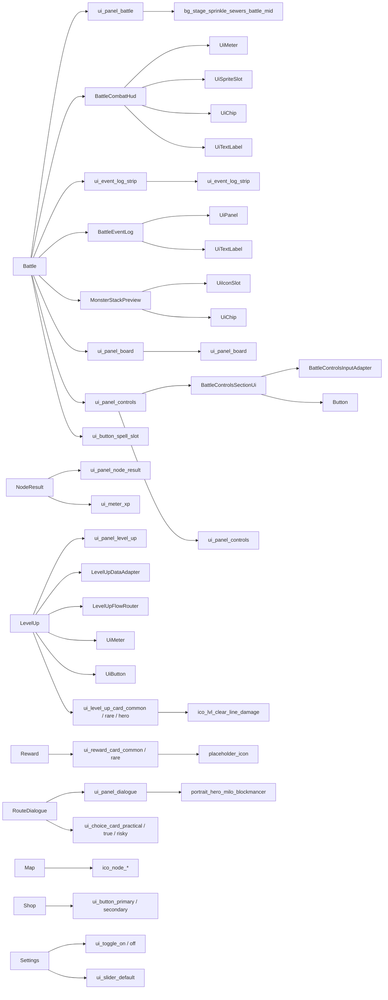

# Blockmancer UI Component Dependency Graph

## Purpose
Map screens to reusable components and asset keys so implementation work can assess shared UI impact.

## Source of truth references
- docs/00_BLOCKMANCER_SOURCE_OF_TRUTH_INDEX.md
- docs/01_BLOCKMANCER_GAME_DESIGN_SOURCE_OF_TRUTH.md
- docs/04_BLOCKMANCER_ASSET_ANIMATION_SOURCE_OF_TRUTH.md
- docs/05_BLOCKMANCER_RELEASE_IMPLEMENTATION_SOURCE_OF_TRUTH.md
- docs/06_BLOCKMANCER_CANONICAL_FOLDER_STRUCTURE_SOURCE_OF_TRUTH.md
- docs/07_BLOCKMANCER_MONSTER_WIKIPEDIA_SOURCE_OF_TRUTH.md

## Relevant screen/component/layout content

## Asset key/fallback rules when applicable
Shared components must keep the same asset keys across screens unless a screen-specific variant is documented.

## Pixel-perfect or QA guidance when applicable
Changing a shared component requires checking every screen listed in layout JSON relatedComponents.

## Status / known gaps
This is a manual Mermaid graph based on CodeGraph scene/file evidence and the new layout specs.

## UI-9 Festival Level-Up Status Notes

`LevelUpRewardScene` now uses shared UI primitives for panel, meter, icon slot, and button rendering. `LevelUpDataAdapter` maps upgrade content into card view models with icon, name, rarity, stack count, stack limit, and effect text. `LevelUpFlowRouter` owns one-selection application, pending level-up consumption, reroll reset, and reward/map routing.

## UI-13 Shop / Inventory / Settings Status Notes

`ShopScene` now uses shared `UiPanel`, `UiIconSlot`, and `UiButton` components driven by `ShopDataAdapter`, while all purchases still dispatch through `ShopSystem`. `BattleScene` uses `InventoryDataAdapter` to render the existing bag modal with item, relic, and spell cards plus an item detail panel; only existing battle item-use handlers are actionable. `SettingsScene` uses `SettingsDataAdapter` to group existing settings into audio, accessibility, and controls tabs with shared sliders, toggles, and buttons.

## UI-14 Outer Flow Status Notes

`BootScene`, `MainMenuScene`, `HeroSelectScene`, `GameOverScene`, and `VictoryScene` now use shared `UiPanel`, `UiButton`, `UiIconSlot`, `UiSpriteSlot`, and `UiMeter` primitives through `OuterFlowUi` helpers. Existing new-run, continue, hero unlock, route ending, victory, defeat, clear-save, and settings routing behavior is preserved.
