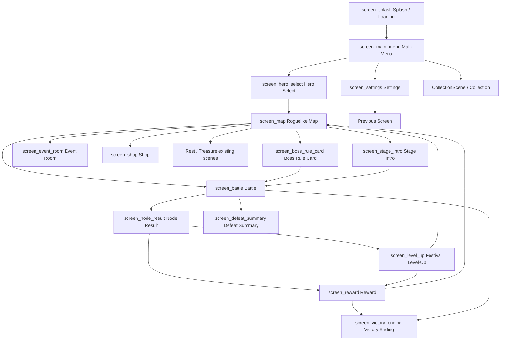

# Blockmancer UI Screen Flow Graph

## Purpose
Document screen-to-screen navigation for the UI mockup framework in Mermaid-compatible form.

## Source of truth references
- docs/00_BLOCKMANCER_SOURCE_OF_TRUTH_INDEX.md
- docs/01_BLOCKMANCER_GAME_DESIGN_SOURCE_OF_TRUTH.md
- docs/04_BLOCKMANCER_ASSET_ANIMATION_SOURCE_OF_TRUTH.md
- docs/05_BLOCKMANCER_RELEASE_IMPLEMENTATION_SOURCE_OF_TRUTH.md
- docs/06_BLOCKMANCER_CANONICAL_FOLDER_STRUCTURE_SOURCE_OF_TRUTH.md
- docs/07_BLOCKMANCER_MONSTER_WIKIPEDIA_SOURCE_OF_TRUTH.md

## Relevant screen/component/layout content

## Asset key/fallback rules when applicable
Each screen node maps to a layout JSON whose components define fallbackAssetKey. Navigation does not alter asset keys.

## Pixel-perfect or QA guidance when applicable
Flow changes must not introduce screens without 1080x1920 layout specs and asset contracts.

## Status / known gaps
Rest, Treasure, Help, Tutorial, Hub, and Collection have runtime scenes but are outside the mandatory JSON list except where represented as flow branches.

## UI-4 Battle Shell Note

`screen_battle` now has a runtime structural shell matching the canonical 1080x1920 portrait layout and exact 25/55/20 combat, puzzle, and controls split. Detailed combat HUD and event log content are implemented through UI-5. Board rails, Hold/Next Queue, right stat cards, and inventory indicator are UI-6 work. Mobile controls are implemented through UI-7 with battle-local bag and pause shortcuts only; full inventory/settings screens remain separate flow nodes.

## UI-9 Festival Level-Up Note

`screen_level_up` now resolves after `screen_node_result` when `pendingLevelUps > 0`. Selection applies one upgrade, consumes one pending level-up, loops back to `LevelUpRewardScene` while more pending level-ups remain, then routes to `RewardScene` when rewards/stage advance are pending or directly to `MapScene` when no rewards remain.
